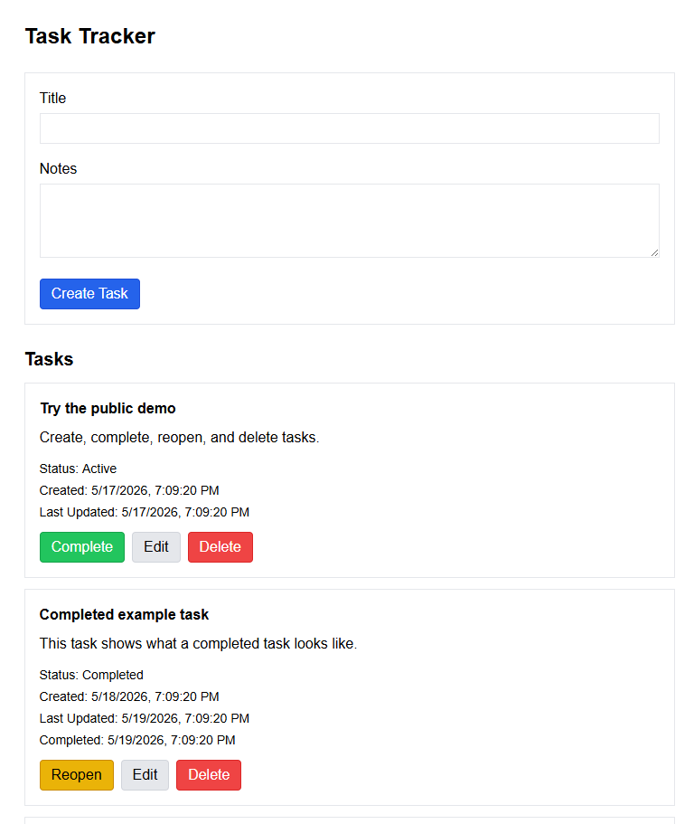
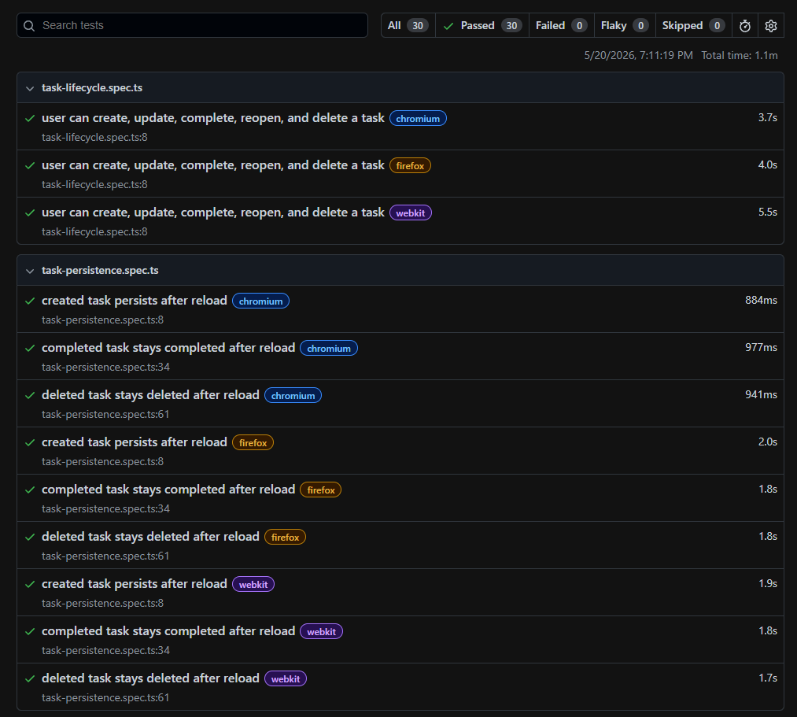
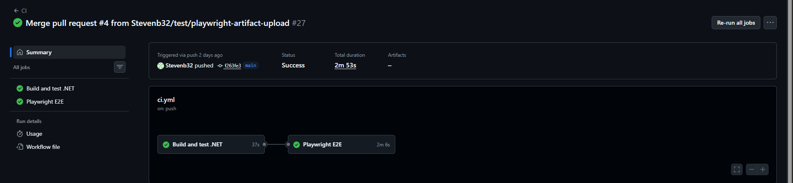

# TaskTracker
[](https://github.com/Stevenb32/TaskTracker/actions/workflows/ci.yml)

TaskTracker is a full-stack QA automation portfolio project built to demonstrate practical SDET skills across backend testing, API integration testing, UI automation, Dockerized test environments, CI, and deployment.

The app is intentionally small, but the testing and delivery workflow are designed to mirror real-world quality practices: domain unit tests, API integration tests, Playwright E2E tests, isolated test data, database reset support, and GitHub Actions CI.

Live demo: [https://tasktracker.stevenborkowski.dev](https://tasktracker.stevenborkowski.dev)

## Testing Strategy

This project uses a layered testing approach:

- Domain unit tests verify task business rules without API, UI, or database dependencies.
- API integration tests verify HTTP behavior using `WebApplicationFactory`.
- Playwright E2E tests verify user workflows through the React UI against a real PostgreSQL E2E database.
- GitHub Actions runs automated checks for .NET tests and Playwright E2E tests on pushes and pull requests.

## Quality Practices Demonstrated

- Layered test coverage across domain, API, and UI
- Playwright E2E tests using isolated test data
- E2E database reset endpoint for reliable, repeatable tests
- Docker Compose environments for development and E2E testing
- GitHub Actions CI for automated validation
- API integration tests using `WebApplicationFactory`
- Validation and boundary testing for task input rules
- Public demo environment with reset and seed support

## Project Preview

### Application UI



### Playwright E2E Report



### GitHub Actions CI



## Tech Stack

- .NET 10 Minimal API
- EF Core with PostgreSQL
- React with Vite
- Tailwind CSS
- xUnit, FluentAssertions, and WebApplicationFactory
- Playwright
- Docker and Docker Compose
- Nginx reverse proxy
- GitHub Actions CI

## Current Features

- Create tasks with a title and optional notes
- View, edit, complete, reopen, and delete tasks
- Validate core task rules in the domain layer
- Store local, Dev, E2E, and demo data in PostgreSQL
- Reset and seed the public demo database
- Cover domain behavior with unit tests
- Cover API behavior with integration tests
- Cover the main UI workflow with Playwright E2E tests
- Run automated CI checks for .NET tests and Playwright E2E tests
- Serve the UI and API through `/api` routing in the demo environment

## Project Structure

```text
TaskTracker.Domain        Core task domain logic
TaskTracker.Domain.Tests  Domain unit tests
TaskTracker.Api           .NET Minimal API
TaskTracker.Api.Tests     API integration tests
TaskTracker.Ui            React frontend
TaskTracker.E2E.Tests     Playwright E2E tests
docs                      Setup, testing, and demo notes
scripts                   Demo database utility scripts
sql                       Local database helper queries
```

## Run Locally

See [Setup](docs/setup.md). The local workflow uses PostgreSQL from Docker Compose, the API at `http://localhost:5127`, and the Vite UI at `http://localhost:5173`.

## Run Tests

See [Testing](docs/testing.md). The repo includes domain unit tests, API integration tests, Playwright E2E tests, and GitHub Actions CI.

## Public Demo

See [Production Demo](docs/production-demo.md). The public demo is hosted on a Raspberry Pi using Docker Compose, Nginx reverse proxy routing, and Cloudflare.

## Documentation

More detailed setup and workflow notes are available in the `docs` folder:

- [Setup](docs/setup.md)
- [Testing](docs/testing.md)
- [Production Demo](docs/production-demo.md)

## Project Status

The main task workflow, API, frontend, unit tests, integration tests, E2E test, CI workflow, Docker demo setup, public routing, and demo database reset process are in place.

Planned improvements include branch protection practice, additional Playwright coverage, Postman/Newman API tests, filtering, and a portfolio project page.
